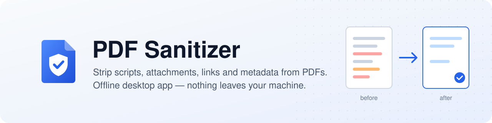

<div align="center">

<picture>
  <source media="(prefers-color-scheme: dark)" srcset="docs/public/banner-dark.svg">
  
</picture>

<br>

[](https://github.com/e-choness/pdf-sanitizer/releases/latest)
[](https://github.com/e-choness/pdf-sanitizer/releases)
[](https://github.com/e-choness/pdf-sanitizer/actions/workflows/test.yml)
[](https://e-choness.github.io/pdf-sanitizer/)
[](LICENSE)

[](https://github.com/e-choness/pdf-sanitizer/releases/latest)
[](https://tauri.app)
[](https://www.rust-lang.org)
[](https://svelte.dev)
[](https://github.com/e-choness/pdf-sanitizer/commits/main)

**[Download](https://github.com/e-choness/pdf-sanitizer/releases/latest)** ·
**[Documentation](https://e-choness.github.io/pdf-sanitizer/)** ·
**[Changelog](https://e-choness.github.io/pdf-sanitizer/changelog)** ·
**[Report a bug](https://github.com/e-choness/pdf-sanitizer/issues/new)**

</div>

---

PDF files can carry JavaScript, auto-run actions, hidden attachments, tracking
links and metadata about who made them and with what. **PDF Sanitizer** removes
all of that and swaps each file for a clean copy, keeping the original in a
backup folder. It is a single offline Windows app: no installer, no account and
no network access.

## ✨ Features

| | |
|---|---|
| 🛡️ **Removes active content** | JavaScript, `OpenAction`/`AA` triggers, launch, submit-form and media actions, XFA forms |
| 📎 **Removes hidden payloads** | Embedded files and file-attachment annotations |
| 🕵️ **Removes metadata** | Author, dates, producer software, XMP streams |
| 🔗 **Strips outbound links** | URL and remote-file links (optional) |
| ✅ **Verifies every result** | Re-parses the output and checks page count, content streams and leftover scripts before touching the original |
| 🗂️ **Keeps originals** | Moves each original to a backup folder you choose; the clean file takes its place |
| ⚡ **Batch processing** | Up to 8 files in parallel, with per-file progress, stop and retry |
| 🪶 **Shrinks files** | Optional TrueType font subsetting and JPEG image recompression |

See **[What gets removed](https://e-choness.github.io/pdf-sanitizer/guide/sanitization)**
for the full list.

## 🚀 Quick start

1. Download **`pdf-sanitizer.exe`** from the
   [latest release](https://github.com/e-choness/pdf-sanitizer/releases/latest).
   There's no installer; just run it.
2. Drag PDFs onto the window, or click **Add files…**.
3. Choose a **Backup folder** under *Settings → Output*.
4. Click **Sanitize**.

Cleaned PDFs are left at their original paths, and the originals are in the
backup folder. → [User guide](https://e-choness.github.io/pdf-sanitizer/guide/getting-started)

> [!NOTE]
> The executable is not code-signed. If Windows SmartScreen warns you, choose
> **More info → Run anyway**. The app needs the WebView2 runtime, which comes
> with Windows 11 and up-to-date Windows 10.

## 🛠️ Build from source

```bash
git clone https://github.com/e-choness/pdf-sanitizer.git
cd pdf-sanitizer
pnpm install
pnpm tauri dev                                   # run with hot reload
```

Or cross-compile the Windows `.exe` from any OS with Docker:

```bash
docker build --target export --output . .
```

| Guide | |
|---|---|
| [Local setup](https://e-choness.github.io/pdf-sanitizer/development/setup) | Prerequisites, project layout, commands |
| [Architecture](https://e-choness.github.io/pdf-sanitizer/development/architecture) | How the UI, Tauri shell and core library fit together |
| [Testing](https://e-choness.github.io/pdf-sanitizer/development/testing) | Automated checks and the release checklist |
| [Building](https://e-choness.github.io/pdf-sanitizer/development/building) | Docker and native builds, build profiles, caching |
| [Releasing](https://e-choness.github.io/pdf-sanitizer/development/releasing) | Versioning, stable and beta releases, docs deployment |

## 📈 Project activity

<a href="https://github.com/e-choness/pdf-sanitizer/graphs/contributors">
  
</a>

<a href="https://star-history.com/#e-choness/pdf-sanitizer&Date">
  <picture>
    <source media="(prefers-color-scheme: dark)" srcset="https://api.star-history.com/svg?repos=e-choness/pdf-sanitizer&type=Date&theme=dark">
    
  </picture>
</a>

## 📄 License

Licensed under the [PolyForm Noncommercial License 1.0.0](LICENSE). It's free
for personal, research, educational and other noncommercial use. Commercial
use requires a separate license from the author.

Copyright © 2026 Beili (Echo) Yin
